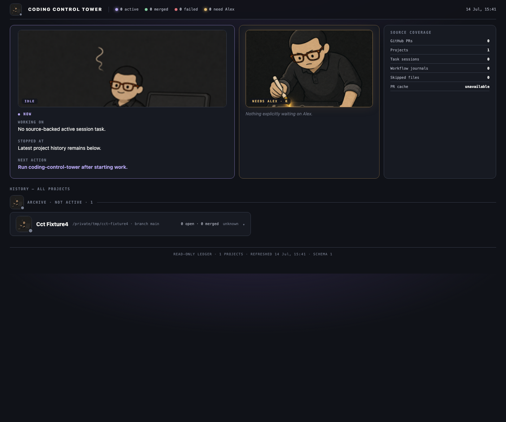

# Coding Control Tower

A local, project-first dashboard for answering:

- What am I working on now?
- Where did work stop?
- What should happen next?
- Which pull requests belong to each project?
- What does each PR explicitly claim it delivered?



## Install

With pip (or pipx):

```bash
pipx install coding-control-tower
# or
python -m pip install --user coding-control-tower
```

With Homebrew:

```bash
brew install mohan-n-swamy/tap/coding-control-tower
```

From source:

```bash
pipx install git+https://github.com/mohan-n-swamy/coding-control-tower.git
```

Then configure and run:

```bash
coding-control-tower init
coding-control-tower
```

The setup wizard asks for your name, project folders, and whether to use GitHub. Change the
display name later:

```bash
coding-control-tower config set name "Alex"
```

## Adapters

The tower reads your agents' exhaust through adapters. Built-ins cover Claude Code,
Codex, and GitHub. To add your own source, drop a Python file into any directory
listed in `adapter_dirs` (config.json):

```python
# my_adapter.py — the entire interface
def collect(config) -> dict:
    return {
        # today's token usage rows to merge into MODEL USAGE
        "usage_models": [{"provider": "X", "model": "m", "tin": 0, "tout": 0, "approx": True}],
        # per-project "where it stands" overlays (project id -> fields)
        "wrapups": {"my-project": {"focus": "…", "next": "…", "blockers": "…"}},
    }
```

Only those two channels exist. A failing adapter degrades to absence and appears in
`adapterErrors` — it can never crash the scan. Approximate numbers must be flagged
`approx`; the UI renders them with a `~`.

## Works in different environments

```bash
coding-control-tower init
coding-control-tower
```

The setup wizard asks for your name, project folders, and whether to use GitHub. Change the
display name later:

```bash
coding-control-tower config set name "Alex"
```

## Works in different environments

- macOS, Linux, and Windows path conventions
- any project-folder layout
- recursive Git repository discovery with configurable depth
- Claude Code adapter when `~/.claude` (or `CLAUDE_CONFIG_DIR`) exists
- Codex adapter when `~/.codex` (or `CODEX_HOME`) exists
- optional GitHub PR history through authenticated `gh`
- no Obsidian dependency
- no cloud service, account, database, Node.js, or telemetry

Missing adapters degrade visibly. Project folders remain useful even without Claude, Codex,
or GitHub.

## Commands

```text
coding-control-tower init               configure owner and folders
coding-control-tower                    scan, open, and keep dashboard fresh
coding-control-tower scan               write one local snapshot
coding-control-tower scan --refresh-github
coding-control-tower serve --no-open    serve without opening a browser
coding-control-tower doctor             inspect adapters and configuration
coding-control-tower config             show configuration
coding-control-tower config set name Alex
```

Dashboard binds only to `127.0.0.1`. Snapshot and config use OS-standard application-data
folders. GitHub cache refreshes at most every 15 minutes. The server rescans local sources every
30 seconds.

## Evidence rules

- Active projects first; remaining projects by latest observed activity.
- Session work maps through observed working directory. Missing evidence stays `Unassigned`.
- Separate unknown sessions never collapse into one mixed bucket.
- Local work nests under a PR only with an exact `PR #N` reference.
- Failed workflow never appears as built.
- Merge status alone never becomes a delivery claim. Delivery text requires an explicit PR-body
  section named `Outcome`, `Delivered`, `Deploy state`, or `Done proof`.

## Privacy

Coding Control Tower is read-only. It does not read Codex prompt bodies, send telemetry, mutate
repositories, merge PRs, or deploy code. It redacts common token formats before writing local
state. Paths and work titles remain on the local machine and are visible in the local dashboard.

See [SECURITY.md](SECURITY.md) for reporting vulnerabilities.

## Development

```bash
python -m unittest discover -s tests -v
python -m pip install --no-deps .
coding-control-tower init --non-interactive --name Test --project-root "$PWD" --no-github
coding-control-tower scan
```

MIT licensed.

