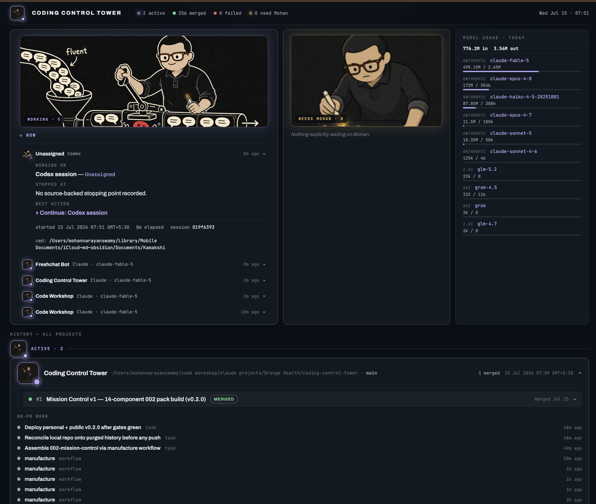

# Coding Control Tower

**Mission control for developers who run many AI coding agents in parallel.** One
local page that answers the only four questions that matter when you come back to
your desk:

1. **What is running right now?** — every live Claude Code / Codex session, the moment its transcript moves
2. **What is blocked on ME?** — agents silently parked on a question, with the actual question and a copy-paste jump command
3. **Where did each project stop, and what's next?** — source-backed resume packets, not guesses
4. **What did today cost?** — token spend across every provider in one block



## Why we built this

Running six agent sessions across tmux tabs has a visibility problem tmux can't
solve: half of them are working, one crashed an hour ago, and one has been waiting
40 minutes for you to answer a question you never saw. Existing dashboards track
PRs or tasks — they measure habits, not reality. The tower reads the **exhaust your
tools already produce** (session transcripts, PR bodies, git repos) so there is
nothing to maintain: no tags, no cloud, no telemetry, no new writing burden. When
a signal can't be verified from a source, the dashboard says so instead of
inventing one — that honesty rule shapes every panel.

## What you get

- **NOW board** — every live session as a collapsible row (project · agent · model
  · age). Expand any row: what it's working on, where it stopped, the next action,
  elapsed time, cwd — and a ⧉ copy of `cd <repo> && claude --resume <session>`
  that survives a terminal crash.
- **NEEDS YOU queue** — sessions blocked on an unanswered question (detected from
  the transcript: a blocking tool call with no recorded answer, kept for 24h so a
  crashed terminal doesn't hide it). Shows the question, wait-age, and the resume
  command. Zero false positives is treated as a shipping requirement.
- **Resume packets everywhere** — every project card (active or dormant) ends with
  a copy-paste packet to hand any agent: the repo's `STATUS.md` if present,
  otherwise a packet composed from the last session wrap-up.
- **Closure loop** — `coding-control-tower wrapup` records focus / next step /
  blockers at session end (`--park` to mark parked). Ships with a drop-in Claude
  Code skill template (`docs/skills/wrap-up.md`) so your agents close sessions
  properly without you typing.
- **MODEL USAGE · TODAY** — exact token counts where the source records them,
  `~` where approximated, "not tracked" where a provider is detected but
  unmeasurable. Never silently invented.
- **Truthful buckets** — ACTIVE / LIVE / DORMANT / ARCHIVE mean what they say;
  idle-but-recent projects stay visible, only genuinely untouched ones archive
  (threshold configurable).
- **PR contract cards** — each PR shows its body's checklist as a task meter,
  its own claimed progress, and evidence badges. Merge status alone never counts
  as "delivered" — that requires an explicit Outcome section in the PR body.

## Install

With Homebrew:

```bash
brew install mohan-n-swamy/tap/coding-control-tower
```

With pip (or pipx), straight from GitHub:

```bash
pipx install git+https://github.com/mohan-n-swamy/coding-control-tower.git@v0.3.0
# or
python -m pip install --user git+https://github.com/mohan-n-swamy/coding-control-tower.git@v0.3.0
```

Then configure and run:

```bash
coding-control-tower init
coding-control-tower
```

The setup wizard asks for your name, project folders, and whether to use GitHub.
Change the display name later with `coding-control-tower config set name "Alex"`.

## Closing a session

Record where a project stands when you stop — the dashboard turns it into the
resume packet:

```bash
coding-control-tower wrapup --focus "hardened retry queue" \
  --next "pin RNG seed in test_backoff_jitter" --blockers ""
```

Add `--park` when you intend to pick it up soon (shows as `[parked]`). Run it from
anywhere inside the repo; interactive prompts fire if you omit the flags. Agents
can close sessions for you: copy `docs/skills/wrap-up.md` into your Claude Code
project's `.claude/skills/`, or have Codex run the same command.

## Adapters

The tower reads your agents' exhaust through adapters. Built-ins cover Claude Code,
Codex, GitHub, and the wrap-up files above. To add your own source, drop a Python
file into any directory listed in `adapter_dirs` (config.json):

```python
# my_adapter.py — the entire interface
def collect(config) -> dict:
    return {
        # today's token usage rows to merge into MODEL USAGE
        "usage_models": [{"provider": "X", "model": "m", "tin": 0, "tout": 0, "approx": True}],
        # per-project "where it stands" overlays (project id -> fields)
        "wrapups": {"my-project": {"focus": "…", "next": "…", "blockers": "…"}},
    }
```

Only those two channels exist. A failing adapter degrades to absence and appears in
`adapterErrors` — it can never crash the scan. Approximate numbers must be flagged
`approx`; the UI renders them with a `~`.

## Works in different environments

- macOS, Linux, and Windows path conventions
- any project-folder layout; recursive git discovery with configurable depth
- Claude Code adapter when `~/.claude` (or `CLAUDE_CONFIG_DIR`) exists
- Codex adapter when `~/.codex` (or `CODEX_HOME`) exists
- optional GitHub PR history through authenticated `gh`
- no cloud service, account, database, Node.js, or telemetry

Missing adapters degrade visibly. Project folders remain useful even without
Claude, Codex, or GitHub.

## Commands

```text
coding-control-tower init               configure owner and folders
coding-control-tower                    scan, open, and keep dashboard fresh
coding-control-tower scan               write one local snapshot
coding-control-tower scan --refresh-github
coding-control-tower serve --no-open    serve without opening a browser
coding-control-tower wrapup             close the session: focus / next / blockers (--park)
coding-control-tower doctor             inspect adapters and configuration
coding-control-tower config             show configuration
coding-control-tower config set name Alex
```

Dashboard binds only to `127.0.0.1`. Snapshot and config use OS-standard
application-data folders. GitHub cache refreshes at most every 15 minutes. The
server rescans local sources every 30 seconds.

## Evidence rules

- Active projects first; remaining projects by latest observed activity.
- Session work maps through observed working directory. Missing evidence stays `Unassigned`.
- Separate unknown sessions never collapse into one mixed bucket.
- Local work nests under a PR only with an exact `PR #N` reference.
- A failed workflow never appears as built.
- Merge status alone never becomes a delivery claim. Delivery text requires an explicit PR-body
  section named `Outcome`, `Delivered`, `Deploy state`, or `Done proof`.

## Privacy

Coding Control Tower is read-only. It never executes commands on your behalf — the
resume buttons copy text, nothing more. It does not read Codex prompt bodies, send
telemetry, mutate repositories, merge PRs, or deploy code. It redacts common token
formats before writing local state. Paths and work titles remain on the local
machine and are visible in the local dashboard.

See [SECURITY.md](SECURITY.md) for reporting vulnerabilities.

## Development

```bash
python -m unittest discover -s tests -v
python -m pip install --no-deps .
coding-control-tower init --non-interactive --name Test --project-root "$PWD" --no-github
coding-control-tower scan
```

MIT licensed.
